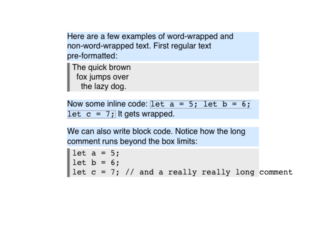

<!-- README.md is generated from README.Rmd. Please edit that file -->

# SINAB is not a browser

A basic html rendering engine for R, written in Rust. The purpose is not
to write a browser, but rather to provide the ability to render simple,
static html documents to an R graphics device.

An initial rendering engine has been implemented, though its feature set
remains extremely limited at this time.

``` r
library(sinab)
library(grid)

css <-
'
p       { line-height: 1.2; background-color: #eee; }
.box    { background-color: skyblue; }
.brown  { color: red; font-family: "Comic Sans MS"; }
em      { color:green; background-color: cornsilk; }
strong  { background-color: lightsalmon; }
strong em     { color:blue; font-family: monospace; }
strong .brown { color:brown; font-size: 24px; background-color: skyblue; }
'

mdtext <-
'The **very quick <span class="brown">brown brown brown brown brown brown</span>
*fox fox fox fox*** jumps *over* the <span style="color:#0000ff80">lazy
dog.</span><br>The quick <span class="brown">brown<sup>6</sup></span> fox<sup>4</sup>.'

g <- html_grob(
  mdtext,
  x = unit(0.2, "npc"), y = unit(0.8, "npc"), width = unit(0.6, "npc"),
  css = css
)
grid.newpage()
grid.draw(g)
```



Simple markdown-to-html conversion is also implemented:

``` r
md_to_html("This is *a* **test**.")
#> [1] "<p>This is <em>a</em> <strong>test</strong>.</p>\n"
```

## FAQ

  - **Why is HTML/CSS feature X, Y, or Z not available?**  
    Rendering is done with a purpose-built layouting pipeline, and to
    date only a small subset of all possible features has been
    implemented.

  - **Will you support Javascript?**  
    Probably not. The goal for Sinab is rendering of static pages.
    Interactivity doesn’t work well with R graphics devices.

  - **Is MathML supported?**  
    Not at this time.

  - **Why is rendering so slow?**  
    The Sinab library itself is actually quite fast. Slowness comes
    mostly from R graphics devices. In particular, text shaping is
    extremely slow on some graphics devices. For faster rendering, try
    one of the graphics devices provided by the ragg library, such as
    `agg_png()`.

  - **Why aren’t you supporting links (i.e., the `<a>` tag)?**  
    This is a limitation of the current R graphics device API. There is
    simply no way to create a link in an R graphics device. Once this
    feature gets added, it will be easy to support it in Sinab.

## Acknowledgments

The actual HTML/CSS parsing and rendering code is written in Rust, and
it draws heavily from software developed for the Servo project. HTML
parsing is done with [html5ever](https://github.com/servo/html5ever),
CSS parsing is done with
[cssparser](https://github.com/servo/rust-cssparser), and CSS selectors
are implemented using the
[selectors](https://github.com/servo/servo/tree/master/components/selectors)
crate. DOM, layout, and rendering is using custom code that is in no
small part based on the experimental
[Victor](https://github.com/SimonSapin/victor) project written by Simon
Sapin.

Markdown to HTML conversion is performed through the
[pulldown-cmark](https://github.com/raphlinus/pulldown-cmark) crate,
which implements a lightweight Markdown parser that complies with the
[CommonMark spec.](https://spec.commonmark.org/)
